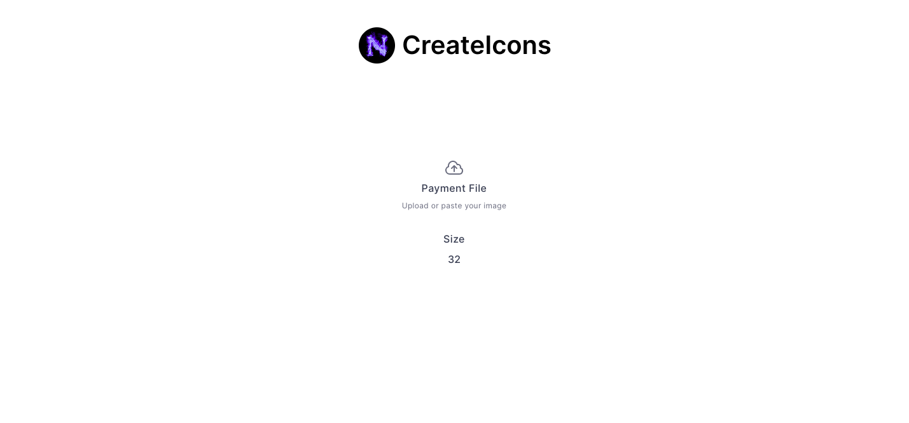
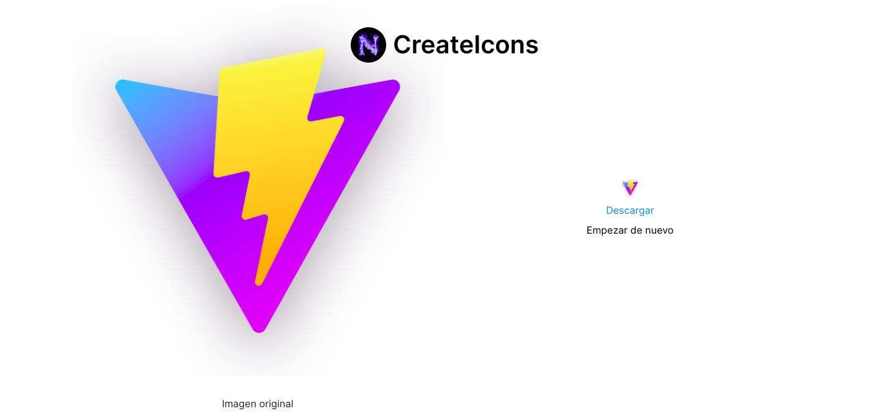

# CreateIcons





## Project Setup

```sh
pnpm i
```

### Compile and Hot-Reload for Development

```sh
pnpm dev
```

### Compile and Minify for Production

```sh
pnpm build
```

## Customize configuration

https://vitejs.dev/config

### Tailwindcss

https://tailwindcss.com/docs/guides/vite#vue
